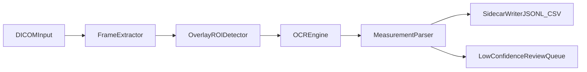

# Echocardiogram Measurement OCR Workplan

## Goal to Capture in `workplan.md`

- Add a dedicated goal section in [workplan.md](/home/warre/Documents/howest/Semester_5/Stage/StageOpdracht/Master/workplan.md):
  - Process multi-frame DICOM studies at scale (~500k images).
  - Detect the blue-gray top-left measurement overlay region.
  - Run OCR on that region and parse measurements into structured key/value fields.
  - Export sidecar outputs (CSV/JSONL) per study/frame with confidence + traceability.

## Proposed Technical Approach

1. **DICOM frame extraction (ingestion layer)**
  - Read DICOM metadata + pixel data.
  - Split multi-frame studies into processable frames.
  - Preserve trace IDs: `study_uid`, `series_uid`, `sop_uid`, `frame_index`.
2. **Overlay ROI detection (fast, deterministic first)**
  - Start with rule-based ROI detection tuned to your “blue-gray top-left box” prior (color/contrast + location constraints).
  - Add fallback template matching for style drift.
3. **OCR stage**
  - Preprocess ROI (grayscale, denoise, contrast normalization, upscale).
  - OCR engine benchmark (Tesseract vs EasyOCR/PaddleOCR) on sampled frames.
  - Keep raw OCR text + per-token confidence.
4. **Measurement parsing + normalization**
  - Parse known measurement patterns (`name`, `value`, `unit`).
  - Normalize units and numeric formats.
  - Mark uncertain fields when confidence or parsing quality is low.
5. **Sidecar output + indexing**
  - Write JSONL (primary) and optional CSV summary.
  - One row/object per extracted measurement with source frame linkage.
6. **Quality loop (no labels yet)**
  - Build an initial manual audit set from stratified samples.
  - Track: ROI detection success, OCR readability, parse success, end-to-end extraction rate.

## Scale & Reliability Plan

- Batch worker pipeline with resumable jobs and progress logging.
- Save intermediate artifacts for failed frames (`roi_crop`, `ocr_raw`) for debugging.
- Add duplicate/frame hashing to avoid reprocessing identical frames.
- Add configurable confidence thresholds to route low-confidence results to review.

## Suggested Output Schema (MVP)

- `study_uid`, `series_uid`, `sop_instance_uid`, `frame_index`
- `measurement_name`, `measurement_value`, `measurement_unit`
- `ocr_text_raw`, `ocr_confidence`, `parser_confidence`
- `roi_bbox`, `pipeline_version`, `processed_at`

## Architecture (MVP)

## Implementation Phases

- **Phase 1 (1-2 weeks):** small prototype on sampled DICOMs, ROI + OCR feasibility.
- **Phase 2 (2-3 weeks):** parser + schema + batch processing + metrics dashboard/logging.
- **Phase 3 (2 weeks):** robustness pass, failure analysis, confidence tuning, larger dry run.
- **Phase 4 (1 week):** documentation and handoff for production-scale execution.

## Decisions Already Made

- Input source: **DICOM-first**.
- Output target (v1): **sidecar files**.
- Prior knowledge: overlay box is **very consistent**.
- Labels: **none yet** (we will create a bootstrap audit set).

## Remaining Information Needed Before Implementation

- A small representative sample of DICOM studies (including known hard cases).
- Any expected measurement dictionary (field names/units clinicians care about first).
- Runtime environment constraints (CPU-only vs GPU availability).
- Privacy/storage requirements for saving ROI crops and OCR text.

