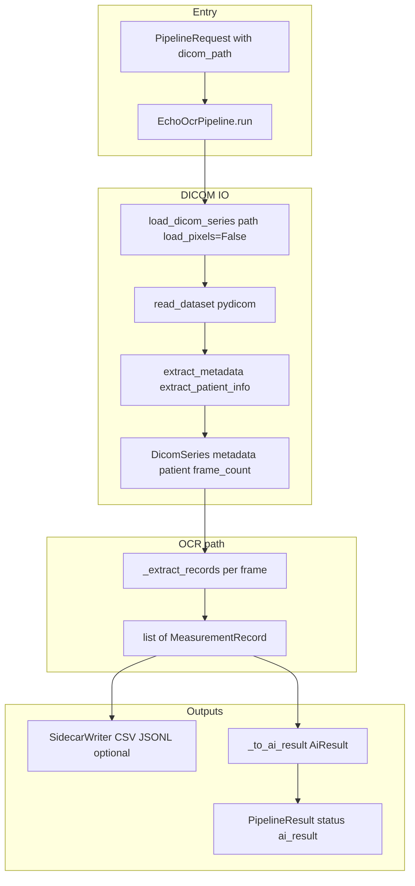
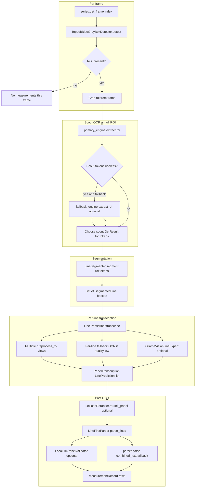
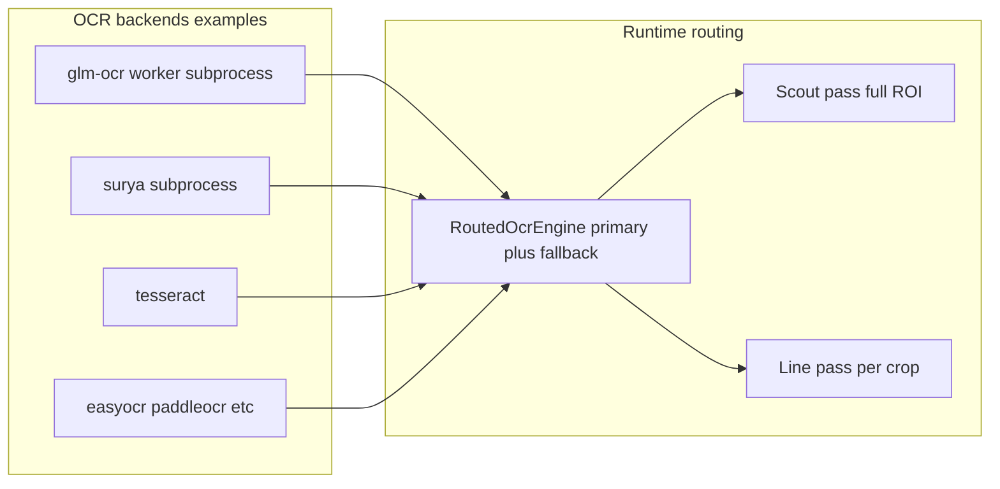
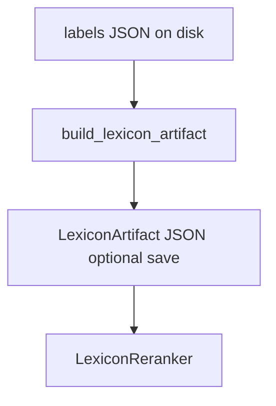
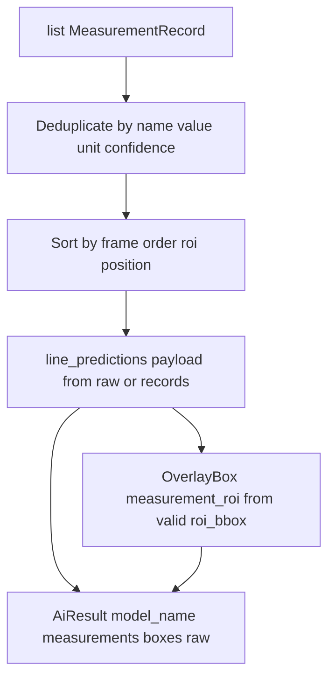

# DICOM image to measurement extraction — OCR pipeline overview

This document maps the **end-to-end OCR path** from a `.dcm` file to structured measurements and UI-facing results. It describes **`EchoOcrPipeline`** (`echo-ocr`): read the on-screen **measurement panel** from pixels, split it into **lines**, run **OCR**, then **parse** into name / value / unit.

---

## What we are doing 

**Goal:** Turn ultrasound (or similar) DICOM frames into **structured measurements** — things like `LVOT Diam 2.1 cm` with a name, numeric value, and unit — so the app can show them, export them, or use them for validation at scale.

**How:** The **panel is an image region**. We find it by color/geometry, cut it into **horizontal lines**, run **OCR** on each line (with preprocessing, optional fallback engines, optional vision), optionally **rerank** candidates using a lexicon built from your labels, then **parse** the text into fields.

Everything below is **machinery** for that: loading pixels, finding the panel, splitting lines, choosing the best OCR guess, and packaging results for the UI.

---

## 1. Top-level flow: DICOM → OCR → records → UI

At run time the pipeline loads series metadata (and loads pixels per frame when processing), runs **per-frame** detection + OCR + parsing, then builds **`AiResult`** and optional sidecar files.

### What each box in the diagram means

| Piece | What it does |
|--------|----------------|
| **PipelineRequest** | Says *which file* to process and optional knobs (max frames, output dir, flags). |
| **EchoOcrPipeline.run** | Orchestrator: load series → loop frames with detection + OCR + parsing → build `AiResult` and optional sidecars. |
| **load_dicom_series (pixels off first)** | Opens the DICOM and reads **metadata** (patient, study IDs, frame count) without loading all pixel data into RAM yet. Pixels load **per frame** when `_extract_records` calls `get_frame`. |
| **read_dataset** | Low-level `pydicom` read of the file bytes into a dataset. |
| **extract_metadata / extract_patient_info** | Turns raw DICOM tags into the app’s `DicomSeries` metadata (modality, UIDs, frame count, etc.). |
| **DicomSeries** | In-memory handle: metadata + `get_frame(i)` (eager or lazy). |
| **_extract_records** | For each frame (up to `max_frames`): ROI detection → scout OCR → segmentation → line OCR → parse → emit `MeasurementRecord` rows. |
| **MeasurementRecord** | One row per measurement: study/series/SOP IDs, frame index, text/value/unit, engine, ROI/line boxes, `source_kind` typically `pixel_ocr`. |
| **SidecarWriter** | If configured, writes CSV/JSONL for offline audit. |
| **_to_ai_result** | Converts records into **`AiMeasurement`**, overlay boxes, and `raw` (exact lines, line predictions, engine stats). |
| **PipelineResult** | `ok` or `error`, plus `ai_result` or an error string. |

### Primary modules (and what they are for)

| Stage | Module | Role in one sentence |
|--------|--------|----------------------|
| Series load | [`dicom_loader.py`](../app/io/dicom_loader.py), [`dicom_reader.py`](../app/io/dicom_reader.py) | Read DICOM bytes, metadata, and frames (eager or lazy). |
| Frame decode / normalization | [`frame_loaders.py`](../app/io/frame_loaders.py), [`normalization.py`](../app/io/normalization.py) | Decode frames; fix photometric interpretation / shape for consistent RGB or gray images. |
| Orchestration | [`echo_ocr_pipeline.py`](../app/pipeline/echo_ocr_pipeline.py) | Wires OCR, segmentation, parsers, lexicon, optional LLM/vision into `run()`. |
| Sidecar export | [`echo_sidecar_writer.py`](../app/pipeline/output/echo_sidecar_writer.py) | Persists measurement rows to disk. |

---

## 2. One frame: image → measurements

For each frame index, the pipeline detects the **top-left blue-gray panel**, runs **scout OCR** on the full ROI (with optional **fallback scout** if primary tokens are useless), **segments** horizontal lines, **transcribes** each line (multiview + optional fallback engine + optional vision expert), optionally **lexicon-reranks** candidates, then **parses** into structured measurements.

### What each step does (in order)

| Step | What it does | Why it matters |
|------|----------------|----------------|
| **get_frame** | Loads one 2D image array for that index. | OCR runs on numpy images, not raw DICOM bytes. |
| **TopLeftBlueGrayBoxDetector** | Finds the vendor **dark blue-gray** panel near the top-left (color mask + optional OpenCV components), returns a **bounding box**. | No panel → no OCR for that frame. |
| **Crop ROI** | Cuts that rectangle out of the frame. | All following steps use a small image, not the full ultrasound view. |
| **Scout OCR (primary)** | One OCR pass on the **whole** ROI for rough text + **tokens** (word boxes). | Token positions help place horizontal line cuts. |
| **Scout fallback** | If primary scout has **no usable token text**, run the **fallback** engine on the same ROI once. | Recovers segmentation hints when the primary chokes on full-panel layout. |
| **LineSegmenter** | Splits the ROI into horizontal **line bboxes** (default: row ink projection + gap midpoints; optional token clustering in `adaptive` mode). | Wrong cuts → wrong text per crop. |
| **LineTranscriber** | Per line crop: preprocess, primary OCR, extra **views** (CLAHE, adaptive threshold), **fallback** OCR if quality is poor, optional **vision LLM**. Picks best candidate per line. | Main place where each measurement line is read clearly. |
| **LexiconReranker** (optional) | If a lexicon exists: propose **repairs** and **re-score** candidates; can optimize across the **whole panel** so lines do not fight over the same best string. | Nudges “almost right” OCR toward label-like text. |
| **LineFirstParser** | Parses each **line string** into structured fields (line-first decoder). | Aligns with how measurement lines are written. |
| **LocalLlmPanelValidator** (optional) | Local text LLM may fix inconsistent panel output. | Usually off unless enabled. |
| **parser.parse fallback** | Regex on **concatenated** OCR text if line-first parse yields nothing. | Safety net for odd layouts. |
| **MeasurementRecord** | Stores line/ROI boxes, engine, confidence; feeds `_to_ai_result` and sidecars. | Bridge to UI and export. |

### Primary modules

| Step | Module | Role in one sentence |
|------|--------|------------------------|
| Panel ROI | [`echo_ocr_box_detector.py`](../app/pipeline/layout/echo_ocr_box_detector.py) | Find the measurement panel box. |
| Preprocessing | [`preprocessing.py`](../app/ocr/preprocessing.py) | Upscale, contrast, threshold variants for OCR. |
| Line geometry | [`line_segmenter.py`](../app/pipeline/layout/line_segmenter.py) | One ROI → many horizontal line crops. |
| Line OCR | [`line_transcriber.py`](../app/pipeline/transcription/line_transcriber.py) | OCR per line: multiview + fallback + optional vision. |
| Engines + routing | [`echo_ocr_pipeline.py`](../app/pipeline/echo_ocr_pipeline.py), [`ocr_engines.py`](../app/pipeline/ocr/ocr_engines.py) | `RoutedOcrEngine` and concrete backends (GLM, Surya, Tesseract, …). |
| Lexicon | [`lexicon_builder.py`](../app/pipeline/lexicon/lexicon_builder.py), [`lexicon_reranker.py`](../app/pipeline/lexicon/lexicon_reranker.py) | Stats from labels; rerank/repair OCR candidates. |
| Parsing | [`line_first_parser.py`](../app/pipeline/measurements/line_first_parser.py), [`measurement_parsers.py`](../app/pipeline/measurements/measurement_parsers.py) | String → structured measurements (+ optional LLM parser modes). |
| Canonicalization | [`measurement_decoder.py`](../app/pipeline/measurements/measurement_decoder.py) | Normalize text, common OCR fixes, prefix/label/value/unit parsing. |
| Panel LLM | [`panel_validator.py`](../app/pipeline/llm/panel_validator.py) | Optional Ollama text model for panel-level fixes. |
| Vision LLM | [`vision_llm.py`](../app/pipeline/llm/vision_llm.py) | Optional Ollama vision for hard line crops. |

---

## 3. OCR engines (how pixels become text)

Engines implement `OcrEngine.extract(image) -> OcrResult` (text, confidence, tokens). Configuration uses pipeline parameters and environment variables; some backends use **subprocess** workers (e.g. GLM-OCR).

### What this layer means in practice

| Concept | What it does |
|---------|----------------|
| **OcrResult** | Full string, confidence, and **tokens** (substrings with optional bounding boxes). |
| **Tokens** | Drive **segmentation** (line boundaries). Empty scout tokens can trigger **fallback scout**. |
| **RoutedOcrEngine** | `extract()` calls **primary**; the pipeline uses **fallback** separately in the transcriber for **per-line** fallback; **scout fallback** lives in `_analyze_frame_detection`. |
| **Scout pass** | One OCR call on the **entire** panel ROI — layout hints, not the final per-line read. |
| **Line pass** | OCR on **each** line crop — main accuracy bottleneck. |

Module: [`ocr_engines.py`](../app/pipeline/ocr/ocr_engines.py).

---

## 4. Lexicon lifecycle (labels to reranker)

On startup the pipeline may **load** a cached lexicon JSON or **rebuild** it from `labels/labels.json` (or legacy `labels/exact_lines.json`) when the label file is newer than the artifact. The artifact feeds **`LexiconReranker`**, which augments and scores OCR candidates using label frequencies, units, order hints, and value statistics.

### What the lexicon is (without jargon)

| Piece | What it does |
|--------|----------------|
| **labels JSON** | Curated reference lines per file (human ground truth). |
| **build_lexicon_artifact** | Counts label families, units, line order, numeric ranges. |
| **LexiconArtifact (JSON)** | Cached stats so startup avoids recomputing every time. |
| **LexiconReranker** | Adds repaired variants and **scores** candidates against those stats. |

Modules: [`lexicon_builder.py`](../app/pipeline/lexicon/lexicon_builder.py), [`lexicon_reranker.py`](../app/pipeline/lexicon/lexicon_reranker.py), wired in [`echo_ocr_pipeline.py`](../app/pipeline/echo_ocr_pipeline.py) (`_load_or_build_lexicon`).

The lexicon does **not** replace OCR; it **chooses and nudges** among OCR outputs.

---

## 5. Final packaging: records, `AiResult`, overlays

`MeasurementRecord` rows (schema in [`echo_ocr_schema.py`](../app/pipeline/output/echo_ocr_schema.py)) are deduplicated and sorted, then converted to:

- **`AiMeasurement`** list for the UI
- **`raw` payload** (`exact_lines`, `line_predictions`, engine stats, and related flags)
- **`OverlayBox` list** for measurement ROIs when line predictions include valid **pixel** `roi_bbox` (positive width and height)

### What each output is for

| Output | What it does |
|--------|----------------|
| **MeasurementRecord** | Internal row: IDs, text, confidence, engine, bbox, source. |
| **Deduplicate** | Same name/value/unit → keep higher-confidence row. |
| **Sort** | Order by frame, line order, ROI position. |
| **line_predictions** | Per-line debug/eval payload: text, uncertainty, bbox, engine. |
| **OverlayBox** | Rectangles for the viewer; only drawn when ROI geometry is valid. |
| **AiResult** | What the app consumes: `measurements`, `boxes`, `raw`, model name, timestamp. |

Types: [`app/models/types.py`](../app/models/types.py) (`AiResult`, `OverlayBox`, `PipelineResult`).

---

## 6. How this connects to the desktop app

The GUI loads series through the same IO layer, registers `EchoOcrPipeline`, and runs work on background workers.

- [`app/main.py`](../app/main.py)
- [`app/pipeline/ai_pipeline.py`](../app/pipeline/ai_pipeline.py)
- [`app/runtime/pipeline_presets.py`](../app/runtime/pipeline_presets.py)
- [`app/ui/workers.py`](../app/ui/workers.py)

| File | What it does |
|------|----------------|
| **main.py** | Starts the Qt application and services. |
| **ai_pipeline.py** | Registers pipelines (`echo-ocr`, etc.) and `PipelineConfig`. |
| **pipeline_presets.py** | Builds `EchoOcrPipeline` with GUI defaults (engine, parser mode, flags). |
| **workers.py** | Runs DICOM load and pipeline off the UI thread. |

---

## 7. Evaluation tooling (not the same code path as all metrics)

**Line-first eval** (`eval_line_transcription`) uses `EchoOcrPipeline.analyze_frame_with_debug` and compares predicted lines to labels — it tracks the **same OCR pipeline** described here.

**Legacy whole-ROI eval** in [`app/validation/evaluation.py`](../app/validation/evaluation.py) runs a **single** `engine.extract` on a trimmed ROI plus a parser; it does **not** run line segmentation or lexicon reranking.

| Tool | What it measures |
|------|------------------|
| **eval_line_transcription** | Does shipped line-first OCR match labeled lines? |
| **evaluation.run_evaluation** | How good is one-shot ROI OCR + parser? (simpler, not identical to production.) |

---

*Diagrams use [Mermaid](https://mermaid.js.org/). If a renderer does not show them, use a Mermaid-capable viewer.*
