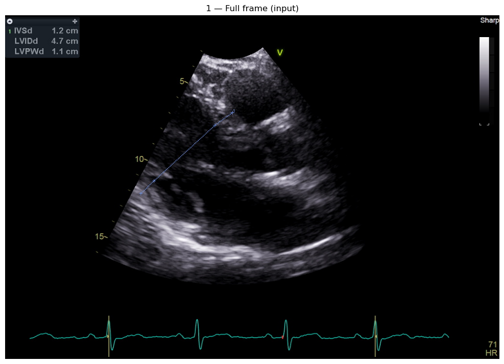
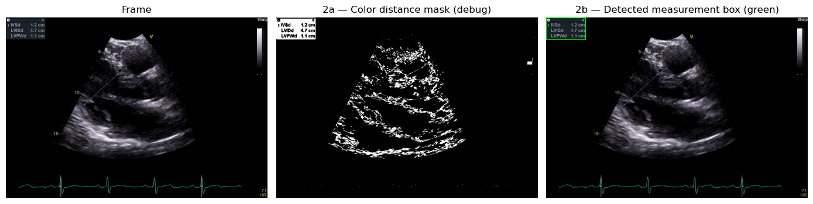
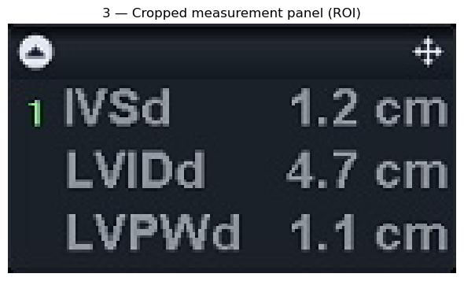
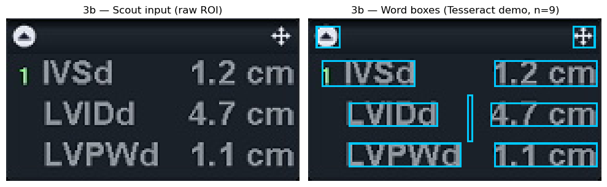
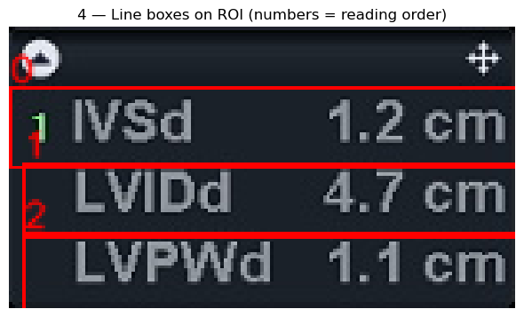
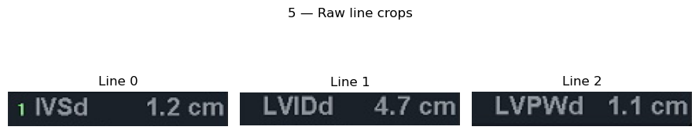
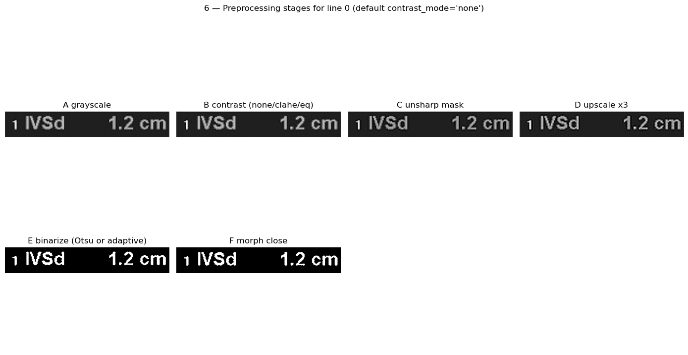
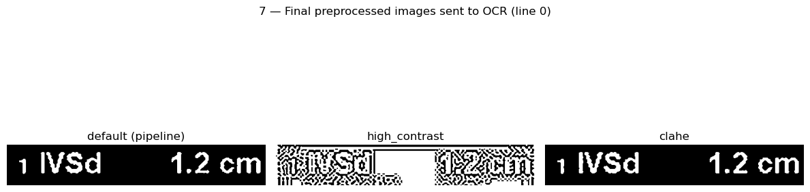

# Echo OCR Pipeline Presentation Deck

Generated from notebooks/echo_ocr_pipeline_walkthrough.ipynb.

# Slide 1 - From Raw Echo Frame to Structured Measurements

## Big Idea
This demo shows the full OCR journey in one clinical echo frame:
1. Load DICOM frame
2. Find measurement panel (ROI)
3. Segment panel into text lines
4. Preprocess each line for OCR
5. Extract text and convert to measurements

## Layout (for presenting)
- Keep this notebook in presentation mode with code hidden when possible.
- For each slide: show markdown first, then run the code cell under it to reveal the image(s).

## Storyline You Can Say
"Everything starts as noisy pixels. The pipeline progressively isolates the signal until OCR becomes reliable enough for structured extraction."

## Demo Setup
- Run all cells top-to-bottom once before presenting.
- Sample DICOM auto-resolves from repo root.
- The figures generated in each section are the images for your slides.

_No image output available for this slide section._

---

## Slide 2 - Raw Input Frame

## What appears on screen
- One full RGB echocardiography frame.
- This is the exact starting point used by the app pipeline.

## Layout suggestion
- Full-width image.
- Bottom caption: "Unstructured, high-noise clinical image".

## Key message
Before OCR, there is no concept of rows, labels, or values, only pixels.

## Talk track
"At this stage the pipeline knows nothing about where measurements are. It only has a normalized frame loaded from DICOM."

---

## Slide 3 - Detect Measurement Panel (ROI Localization)

## What appears on screen
Three panels:
1. Original frame
2. Color-distance debug mask
3. Final bounding box overlay

## Layout suggestion
- Use a 3-column row.
- Emphasize panel 3 with a verbal callout: "this green box is where OCR will happen".

## Key message
We reduce search space early by detecting the vendor-specific blue-gray measurement box in the top-left region.

## Talk track
"Instead of OCR on the entire ultrasound frame, we first isolate the panel. This improves speed and accuracy because downstream steps only process relevant pixels."

---

## Slide 4 - Crop the ROI

## What appears on screen
- A tall cropped measurement panel.
- This array is passed to segmentation and OCR logic.

## Layout suggestion
- Single centered image.
- Add one short annotation: "All downstream logic now runs inside this crop".

## Key message
Cropping removes irrelevant anatomy and machine overlays, letting subsequent models focus on dense text zones.

## Talk track
"This is the first major simplification: full frame to focused panel. Every later operation uses coordinates relative to this ROI."

---

## Slide 5 - Scout OCR Pass on Whole ROI

## What appears on screen
- Left: raw ROI fed into scout OCR.
- Right: optional demo overlay of word boxes (Tesseract visualization).

## Layout suggestion
- 2-column comparison.
- Left column title: "Input to scout pass".
- Right column title: "Token geometry preview".

## Key message
A fast whole-panel OCR pass gives rough textual/positional cues before fine-grained per-line transcription.

## Talk track
"Think of this as reconnaissance. We get an early estimate of where text lives and what it might contain before detailed line-level extraction."

---

## Slide 6 - Segment ROI into Ordered Text Lines

## What appears on screen
- ROI with blue line boxes and order numbers.
- Printed debug info (line count, trim, segmentation metadata).

## Layout suggestion
- Main visual large.
- Keep debug text visible under figure as "technical proof".

## Key message
The pipeline converts one dense text panel into ordered, line-level reading units.

## Talk track
"Segmentation creates deterministic reading order, which is critical for mapping OCR text back to expected measurement patterns."

---

## Slide 7 - Raw Line Crops

## What appears on screen
- Grid of per-line RGB crops.
- Each tile is one OCR unit consumed by the line transcriber.

## Layout suggestion
- Show as gallery/grid.
- Mention that line order in the grid follows segmentation order.

## Key message
This is where the task changes from document detection to focused micro-OCR on small text strips.

## Talk track
"Each crop is tiny but information-dense. At this scale, preprocessing choices have a big impact on recognition quality."

---

## Slide 8 - Preprocessing Pipeline (One Line, Step by Step)

## What appears on screen
Three-panel comparison for one line:
1. Raw grayscale (line crop)
2. **×3 Lanczos grayscale only** — GLM-OCR’s best-performing style from the broad sweep (`gray_x3_lanczos`: no unsharp, no Otsu, no morph)
3. **Default binarized pipeline** — unsharp → ×3 Lanczos → Otsu → morph close (Tesseract-style / legacy stack)

### Preprocessing experiments (GLM-OCR)
Headless sweep: `app/tools/sweep_preprocessing_headless.py`, 15 configs, artifacts in `artifacts/ocr_redesign/preprocess_sweep_glm_broad/` (merged `summary.json`). Labeled validation on the p10 slice: **~95.5% exact** tied `gray_x3_lanczos`, raw gray at 1×, and `unsharp_x3_lanczos`; **gray_x3_lanczos** is the practical default (upscale for tiny crops). Default Otsu+morph land **~94.5%** with occasional file-level failures. **Adaptive-threshold** configs were **~39%** exact — keep them out of the GLM happy path.

## Layout suggestion
- One row, three columns: gray → GLM-optimal upscale → binarized default.

## Key message
Engine-specific preprocessing: GLM did best on **continuous-tone upscaled gray**; binarization stays relevant for classical OCR and for side-by-side comparison.

## Talk track
"We benchmarked many recipes on labeled data. For GLM, simple grayscale plus strong upscale beat heavy binarization; the notebook uses that for the neural transcriber and still shows the binarized pipeline next to it."

---

## Slide 9 - Multi-View Strategy for Hard Lines

## What appears on screen
- Three views of the same line:
  - **gray_x3_lanczos** (GLM-optimized — primary in the walkthrough)
  - **default** binarized pipeline
  - **clahe** (CLAHE + same `preprocess_roi` binarization path)

## Layout suggestion
- 3 equal columns; optional prompt on neural vs. binarized input.

## Key message
Multiple views still matter for hard lines; validation numbers anchor **upscaled gray** for GLM on this dataset.

## Talk track
"We keep alternates for robustness, but the story follows what won on labels: upscale grayscale for GLM, with the classic binarized recipe alongside."

---

## Slide 10 - OCR Extraction and Structured Output

## What appears on screen
- Optional GLM-OCR run over each line using **`preprocess_gray_x3_lanczos`** (sweep winner), not the binarized default.
- Console output with extracted text, confidence, and token counts.
- Optional full pipeline run that emits parsed measurements.

## Layout suggestion
- Split attention: left for line image recap, right for textual OCR results.
- End with one sentence on structured fields (name, value, unit).

## Key message
After progressive cleanup and segmentation, OCR outputs become stable enough to transform into clinical measurement records.

## Talk track
"The final value is not only recognized text, but structured measurements that can feed analytics, QA, and reporting workflows."

---

## Slide 11 - End-to-End Recap and Q&A

## Pipeline Summary
Raw DICOM frame -> ROI detection -> line segmentation -> per-line preprocessing -> OCR -> parsed measurements

## Suggested final layout
- Left: Keep one representative figure visible (ROI with line boxes or preprocessing gallery).
- Right: Show 3 impact bullets:
  1. Faster OCR by reducing search area
  2. Better accuracy through targeted preprocessing
  3. Structured extraction ready for downstream validation

## 30-second close
"This pipeline turns a noisy clinical frame into machine-usable measurement data through staged visual narrowing. Each stage is inspectable, debuggable, and measurable, which makes it practical for both research and production QA."

## Optional backup slides (if asked)
- Compare GLM output on **gray_x3_lanczos** vs. default binarized `preprocess_roi` for a difficult line.
- Run full pipeline with GLM and show parsed measurement tuples.
- Open `artifacts/ocr_redesign/preprocess_sweep_glm_broad/summary.json` for the full 15-config leaderboard.

_No image output available for this slide section._

---
